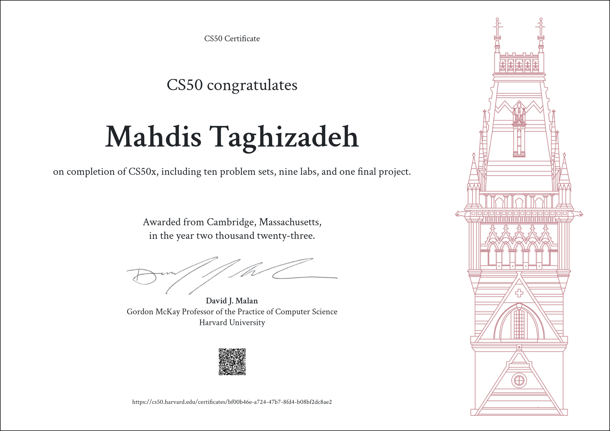

# CS50’s Introduction to Computer Science

### These are my solutions for [CS50's Introduction to Computer Science 2023](https://cs50.harvard.edu/x/2023/).

### Final Project: [Django Blog Site](https://github.com/mahdistz/Blog-Website)

## :warning: Disclaimer:

### ❗ **The following codes are for educational purpose only and not intended to be used / submitted as your own solutions.**

### ❗ **Cheating violates the [Academic Honesty](https://cs50.harvard.edu/x/2023/honesty/) of the course, not to mention it's totally pointless if you actually want to learn programming.**
